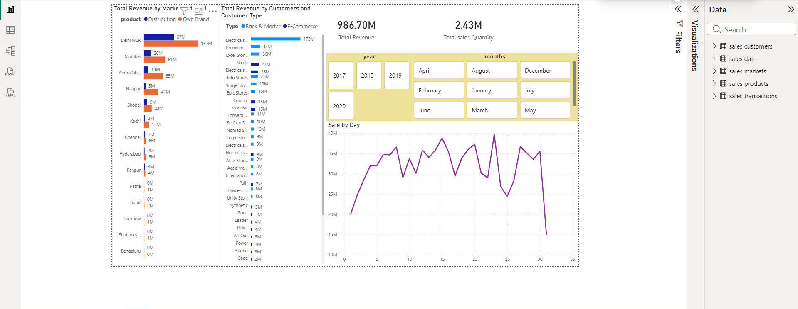
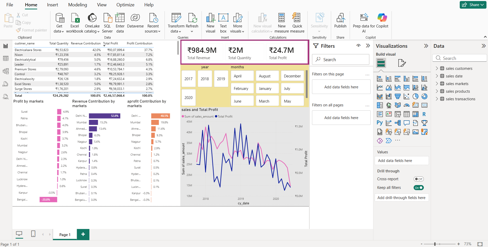

 📊 Sales Insights Dashboard (SQL + Power BI)

🔍 Project Overview

This project focuses on analyzing sales data using **SQL** and visualizing key business insights using **Power BI**.
The goal is to identify trends, improve decision-making, and uncover actionable insights from raw sales data.

---

🛠️ Tools & Technologies Used

* SQL (Data Cleaning & Analysis)
* Power BI (Data Visualization)
* CSV (Dataset)

---

📂 Project Structure

```
sales-insights-sql-powerbi
│
├── dataset
│   └── sales_insight.sql
│
├── power_bi
│   ├── Profit Analysis.pbix
│   ├── Sales Insights Dashboard.pbix
│   ├── Profit Analysis Dashboard Image.png
│   └── Sales Insights Dashboard Image.png
│
├── sql_queries
│   ├── Basic Analysis using SQL.sql
│   └── Data Cleaning using SQL.sql
│
└── README.md
```

---

 📈 Key Analysis Performed

* Data Cleaning and Transformation using SQL
* Sales trend analysis (monthly & overall performance)
* Profit analysis and revenue breakdown
* Identification of top-performing products
* Business insights from raw sales data

---

 📊 Dashboard Features (Power BI)

* Total Sales, Profit, and KPI Metrics
* Sales Insights Dashboard
* Profit Analysis Dashboard
* Interactive filters and slicers
* Visual comparison of performance

---

 🖼️ Dashboard Preview

 📌 Sales Insights Dashboard



 📌 Profit Analysis Dashboard



---

💡 Key Insights

* Identified high-revenue generating products
* Analyzed profit trends across different segments
* Observed patterns in sales performance
* Provided insights for better business decisions

---

🚀 How to Use This Project

1. Explore SQL files inside the `sql_queries` folder
2. Review dataset from the `dataset` folder
3. Open `.pbix` files from the `power_bi` folder in Power BI
4. Interact with dashboards to explore insights

---

 🎯 Project Objective

To demonstrate practical skills in:

* SQL for real-world data analysis
* Data cleaning and transformation
* Building interactive dashboards in Power BI
* Extracting business insights from data

---

 📌 Author

Nihan J

* GitHub: https://github.com/jrnihan11-art
* LinkedIn: www.linkedin.com/in/nihan-j

---

⭐ If you like this project

Give it a ⭐ on GitHub!
